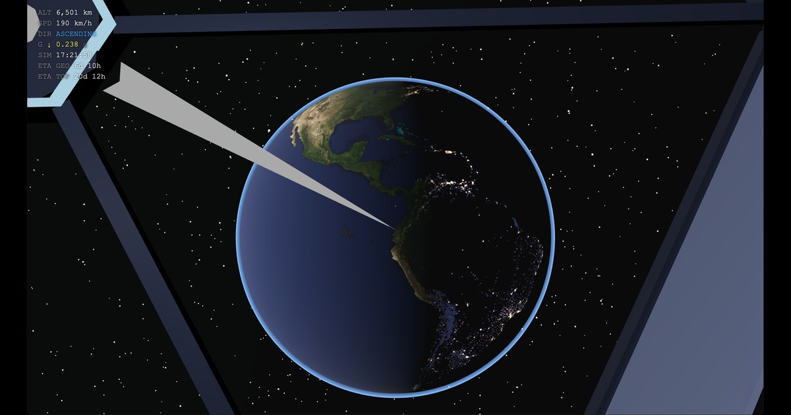

# Space Elevator Simulator

A first-person space elevator ride from sea level to 100,000 km, in your browser.

## Features

- **Real star catalog** — 8,920 naked-eye stars from the HYG v4.1 database with accurate positions, colors, and magnitudes
- **Real physics** — gravity decreases with altitude, flips at geostationary orbit (35,786 km), mag boots for zero-g
- **Day/night cycle** — sun orbits on the sidereal day; watch sunrise and sunset from space
- **14 milestones** — Everest, Karman line, ISS, Hubble, GPS constellation, GEO, and more
- **8K Earth** — cloud-free NASA Blue Marble imagery with high-res regional overlay at low altitudes
- **Ambient soundscape** — wind at the surface fading to silence in space
- **Three simulation modes** — real-time (UTC-synced), sandbox (full control), and cinematic (pre-programmed journeys)
- **Share links** — encode your exact altitude, speed, and direction into a URL
- **About page** — in-app overlay covering space elevator concepts, simulation details, and author info

## Quick Start

```bash
npm install
npm run dev
```

Open `http://localhost:5173` in a browser.

### First-time setup

Generate the 8K Earth texture and star catalog:

```bash
npm run download-textures
npm run process-stars
```

## URL Parameters

Share specific views with URL parameters:

| Param | Example | Description |
|-------|---------|-------------|
| `alt` | `?alt=35786` | Starting altitude (km) |
| `speed` | `?speed=100` | Time scale multiplier |
| `dir` | `?dir=0` | Direction: 1=up, 0=stop, -1=down |
| `cabin` | `?cabin=0` | Hide cabin |
| `stars` | `?stars=2.0` | Star brightness |
| `capture` | `?capture=true` | Download OG image |

## Modes

| Mode | Description |
|------|-------------|
| **Real-Time** | Synced to UTC; ~14-day one-way trip at 300 km/h, shared position for all visitors |
| **Sandbox** | Full control — jump to any altitude, time scale 1×–10,000×, reverse, pause |
| **Cinematic** | Pre-programmed journeys: *Express Ascent* (5 min end-to-end) or *Ludicrous Speed* (1 min to GEO) |

## Controls

- **WASD** — Move around the cabin
- **Mouse** — Look around
- **Space** — Jump (gravity-dependent)
- **Escape / Backtick (`)** — Open/close settings panel

## Built With

- [Three.js](https://threejs.org/) — 3D rendering
- [HYG v4.1](https://github.com/astronexus/HYG-Database) — Star catalog
- [NASA GIBS](https://earthdata.nasa.gov/eosdis/science-system-description/eosdis-components/gibs) — Earth imagery (public domain)
- [Vite](https://vitejs.dev/) — Build tool

## Credits

- Earth textures: NASA Visible Earth / Blue Marble
- Star data: HYG Database by David Nash
- Night lights: NASA Earth Observatory
